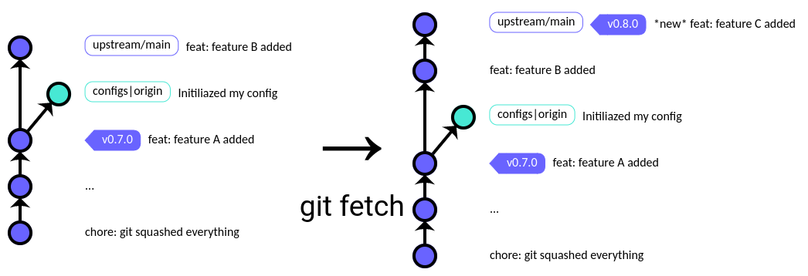
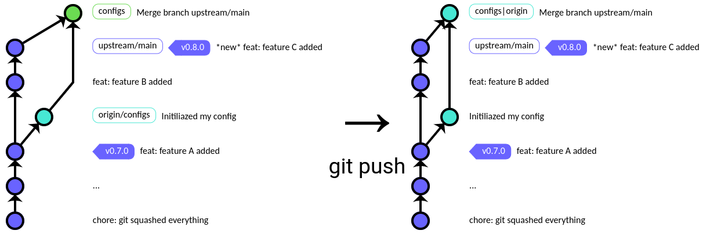

# 2. Setting up your repository for GitOps

To enable GitOps and be able to follow the updates of the ClusterFactory repository, you should [fork](https://docs.github.com/en/get-started/quickstart/fork-a-repo) the [ClusterFactory repository](https://github.com/SquareFactory/ClusterFactory) or create a private copy, so you could use Argo CD on your own repository.

## 1. Fork the repository

### Method 1: Create a public fork

1. Use the "Fork" button on Github and create the fork on your favorite account.

<div style={{textAlign: 'center'}}>


</div>

2. After setting up the fork, `git clone` the fork. Example:

   ```shell title="user@local:/"
   # SSH
   git clone git@github.com:<your account>/ClusterFactory.git
   ```

### Method 2: Create a private fork

1. Create a bare clone of the repository.

   ```shell title="user@local:/"
   git clone --bare https://github.com/SquareFactory/ClusterFactory.git
   ```

2. Create [a new private repository on your favorite Git hosting website](https://docs.github.com/en/repositories/creating-and-managing-repositories/creating-a-new-repository) and name it `ClusterFactory`.

3. Mirror-push your bare clone to your new `ClusterFactory` repository.

   ```shell title="user@local:/"
   cd ClusterFactory.git
   # SSH
   git push --mirror git@github.com:<your account>/ClusterFactory.git
   ```

4. Remove the bare clone.

   ```shell title="user@local:/ClusterFactory.git"
   cd ..
   rm -rf ./ClusterFactory.git

   ```

5. You can now clone your `ClusterFactory` repository on your machine.

   ```shell title="user@local:/"
   # SSH
   git clone git@github.com:<your account>/ClusterFactory.git
   ```

## 2. Setup the upstream remote for git

Git is capable of managing multiple remote repositories. By default, `origin` is linked to the `<your account>/ClusterFactory` repository. To be able to fetch updates from the upstream `SquareFactory/ClusterFactory` repository, we need to add a remote repository that we call `upstream`.

1. Add the upstream and disable push on the remote `upstream`:

   ```shell title="user@local:/ClusterFactory"
   git remote add upstream https://github.com/SquareFactory/ClusterFactory.git
   git remote set-url --push upstream DISABLE
   ```

2. You can list all your remotes with `git remote -v`:

   ```shell title="user@local:/ClusterFactory"
   git remote -v
   # origin	git@github.com:<your account>/ClusterFactory.git (fetch)
   # origin	git@github.com:<your account>/ClusterFactory.git (push)
   # upstream	https://github.com/SquareFactory/ClusterFactory.git (fetch)
   # upstream	DISABLE (push)
   ```

## 3. Checkout to a stable version and create a new branch

You can checkout to a stable version:

```shell title="user@local:/ClusterFactory"
git checkout -b configs v0.7.0
# You can delete the local main branch
git branch -D main
```

## 4. Rename the examples and commit

Copy `argo.example`, `core.example`, `cfctl.yaml.example`, and remove the `.example`:

```shell title="user@local:/ClusterFactory"
cp -R argo.example/ argo/
cp -R core.example/ core/
cp cfctl.yaml.example cfctl.yaml
```

You can track these files on Git:

```shell title="user@local:/ClusterFactory"
git add .
git commit -m "Initialized my config"
git push -u origin configs
# You can also delete the remote main branch
```

## 5. Use `git fetch` and `git merge` to merge the upstream main into the local branch

Because ClusterFactory will be updated regularly, you can fetch the updates with git fetch:

```shell title="user@local:/ClusterFactory"
git fetch --tags upstream
```

<div style={{textAlign: 'center'}}>



</div>

To merge the upstream changes, either rebase or create a merge commit.

```shell title="user@local:/ClusterFactory"
git merge v0.8.0
```

<div style={{textAlign: 'center'}}>


</div>

```shell title="user@local:/ClusterFactory"
git push
```

<div style={{textAlign: 'center'}}>



</div>

---

If you wish to follow the upstream main branch:

```shell title="user@local:/ClusterFactory"
git merge upstream/main
git push
```

## Why fork and use GitOps ?

Now that you have a fork, you can push your own changes into your repository. For example, if you want to deploy your applications, you should write your manifests and commit these files to your repository, like this:

```text
./
├── argo/
├── bin/
├── core/
├── helm/
│   ├── csi-driver-cvmfs/
│   ├── cvmfs-server/
│   ├── cvmfs-service/
│   ├── ipmi-exporter/
│   ├── openldap/
│   ├── slurm-cluster/
│   └── xcat/
├── manifests/                <-----
│   └── my-application/       <-----
│       └── statefulset.yaml  <-----
└── ...
```

Since ClusterFactory uses Argo CD, it is able to retrieve your repository from your Git hosting server, synchronize changes and deploy your Kubernetes manifests.

For now, let's just deploy K0s!
