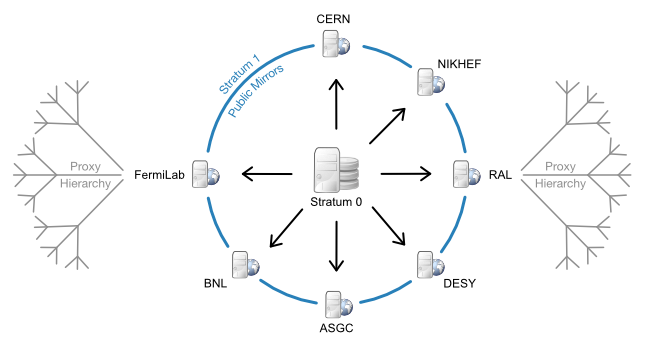

# CernVM-FS, A Scalable, Distributed Read-Only File-System

HPC clusters often use [environment modules](http://modules.sourceforge.net) to share software between compute nodes.
Environment modules are software compiled in a different root (for example `gcc` can be compiled to be installed inside `/cvmfs/software/2022.1/modules/gcc`), and because of this, the environment variables must be modified (like `PATH=/cvmfs/software/2022.1/modules/gcc/bin`).

The problem that environment modules solve is that if we had to manually install each software, the environment would be easily polluted. Using `module load`, it is possible to modify dynamically the environment easily. Moreover, with the environment modules, it is possible to install several versions of the same software.

These environment modules are shared using a distributed, cache-aggressive file-system called CernVM-FS.

The architecture is very similar to a database where the changes are done using the main database (Stratum 0) and the clients are using read-only replicas (Stratum 1). These Stratum 1 are load balanced using Geo API.

Each site is also equipped with a squid proxy, which is a full-featured caching proxy.

An equivalent software could be S3 Fuse.

However, CVMFS is unique because it serves its files via HTTP. The aggressive caching of CVMFS and Squid Proxy makes the data extremely well distributed. It is also possible to use [S3 as a backend for CVMFS](https://cvmfs.readthedocs.io/en/stable/cpt-repo.html#sct-s3storagesetup).

ClusterFactory distributes a CVMFS server container image made to create Stratum 1 CVMFS servers on Kubernetes, so our customers get our software by replicating our CVMFS server.
